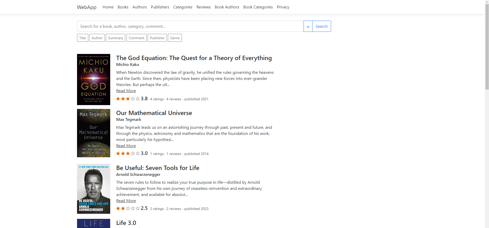
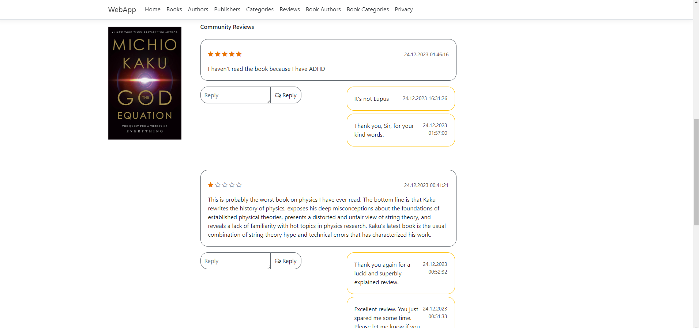
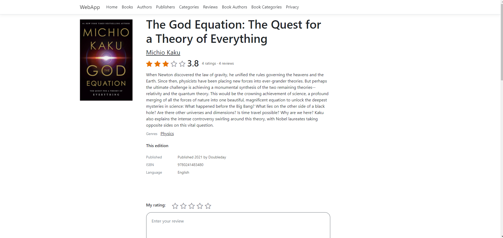

# Library Book Search

## Overview

This is a Razor Pages C# web application for managing a list of books and performing searches. The application allows users to perform CRUD operations on books, add comments/discussions, generate statistics for books and authors, and perform comprehensive searches.





## Features

- **Books CRUD**: Create, Read, Update, and Delete books.
- **Comments/Discussions**: Add and manage comments and discussion threads for books.
- **Statistics**: Generate statistics for books and authors.
- **Search**: Perform searches based on author, publisher, title, summary/description, and comments.

### Prerequisites

- [.NET SDK](https://dotnet.microsoft.com/download)
- [Entity Framework Core](https://docs.microsoft.com/en-us/ef/core/)

## Getting Started

### Prerequisites

Ensure you have the .NET SDK installed. You can download it from [here](https://dotnet.microsoft.com/download).

### Setting Up the Database

1. **Install EF Core Tools**:
    ```bash
    dotnet tool update --global dotnet-ef
    ```

2. **Create a New Migration**:
    ```bash
    dotnet ef migrations add --project DAL.EF --startup-project WebApp InitialCreate
    ```

3. **Update the Database**:
    ```bash
    dotnet ef database update --project DAL.EF --startup-project WebApp
    ```

### Running the Application

1. **Build and Run the Application**:
    ```bash
    dotnet run --project WebApp
    ```

2. Open your browser and navigate to `https://localhost:5001` to access the application.


## Contributing

Contributions are welcome! Please feel free to submit a Pull Request.

## License

This project is licensed under the MIT License.